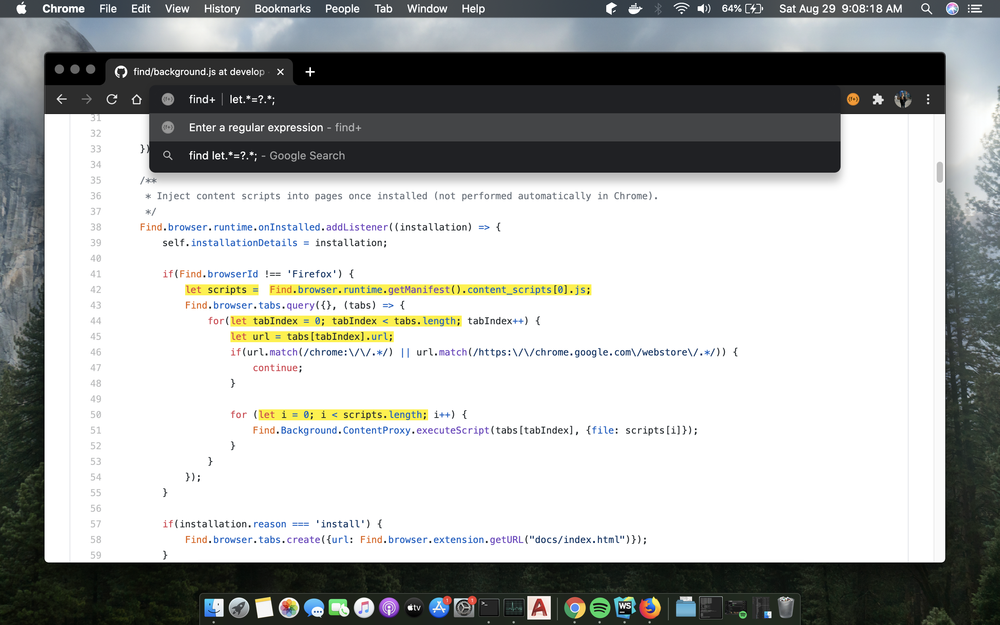

# **{find+}**


**{find+}** is a powerful _Find-in-Page_ extension for Google Chrome hosting the ability to search a web page or document by regular expression. It has been designed to look and behave much like the native `CTRL-F` function, but extended to provide a feature-rich and robust user experience with the aim of completely replacing the native _Find-in-Page_ tool. 

With **{find+}**, you can match a regular expression against text in the page, use find-and-replace to replace text in the page, copy occurrences of a regex to your clipboard, store frequently used expressions, and configure the extension the way you like.


## Motivation
As a software developer, looking through lengthy stack traces, continuous integration build history, or large text files is something we do very regularly. The Chrome _Find-in-Page_ tool works well in most cases, but offers very little when looking for very specific (or very general) keywords.

The idea to build this tool spawned as a response to poorly designed or dysfunctional regex-search extensions currently available, and the limited usefulness of the native tool.

## Getting Started
The **{find+}** extension is available through the Chrome Web Store and through the Firefox Add-ons Store.

 Download the extension here: [find+ | Regex Find-in-Page Tool](https://chrome.google.com/webstore/detail/find%2B/fddffkdncgkkdjobemgbpojjeffmmofb).

 Download the extension here: [{find+} – Get this Extension for 🦊 Firefox](https://addons.mozilla.org/en-US/firefox/addon/brandon1024-find/).

## Keyboard Shortcuts
To open the extension popup using a keyboard shortcut, you must first assign a keyboard shortcut to the extension through the Chrome settings. You can do this by following these steps:
1. Navigate to the `Extensions` settings page in Chrome. Do this easily by typing `chrome://extensions/` in the URL navigation bar.
2. In the top left click on the ☰  menu icon, then click `Keyboard shortcuts`. This will make appear a dialog where you can modify the shortcuts for your installed extensions.
3. Locate the shortcut settings for find+. Click the input field located to the right of the label `Activate the extension`.
4. Press the combination of keys you would like to use to open the extension. Once complete, press `OK`.

Here's what we recommend for displaying the extension popup.

| Windows Shortcut                              | macOS Shortcut                                | Notes                                                                  |
| :-------------------------------------------- | :-------------------------------------------- | :--------------------------------------------------------------------- |
| <kbd>CTRL</kbd>+<kbd>⇧</kbd>+<kbd>F</kbd>     | <kbd>^</kbd>+<kbd>⇧</kbd>+<kbd>F</kbd>        | Recommended: This shortcut will not have any conflicts with Chrome     |
| <kbd>CTRL</kbd>+<kbd>F</kbd>                  | <kbd>⌘</kbd>+<kbd>F</kbd>                     | This shortcut will override the native find-in-page tool               |

Several keyboard shortcuts exist directly in the extension for performing different actions. These shortcuts are built directly into the extension and are not managed through Chrome. As a result, these settings cannot be remapped. Below is a list of the current keyboard shortcuts.

| Windows Shortcut                                   | macOS Shortcut                                     | Action                                                                 |
| :------------------------------------------------- | :------------------------------------------------- | :--------------------------------------------------------------------- |
| <kbd>↵</kbd>                                       | <kbd>↵</kbd>                                       | Advance to the next occurrence of the regular expression in the page   |
| <kbd>⇧</kbd>+<kbd>↵</kbd>                          | <kbd>⇧</kbd>+<kbd>↵</kbd>                          | Return to the previous occurrence of the regular expression in the page|
| <kbd>CTRL</kbd>+<kbd>⇧</kbd>+<kbd>↵</kbd>          | <kbd>^</kbd>+<kbd>⇧</kbd>+<kbd>↵</kbd>             | Follow the first highlighted link in the current occurrence focus      |
| <kbd>CTRL</kbd>+<kbd>ALT</kbd>+<kbd>C</kbd>        | <kbd>^</kbd>+<kbd>⌥</kbd>+<kbd>C</kbd>             | Copy to the clipboard the currently highlighted text on the page.      |
| <kbd>CTRL</kbd>+<kbd>ALT</kbd>+<kbd>A</kbd>        | <kbd>^</kbd>+<kbd>⌥</kbd>+<kbd>A</kbd>             | Copy to the clipboard the all highlighted text on the page.            |
| <kbd>CTRL</kbd>+<kbd>ALT</kbd>+<kbd>O</kbd>        | <kbd>^</kbd>+<kbd>⌥</kbd>+<kbd>O</kbd>             | Expand or Collapse Options Pane                                        |
| <kbd>CTRL</kbd>+<kbd>ALT</kbd>+<kbd>R</kbd>        | <kbd>^</kbd>+<kbd>⌥</kbd>+<kbd>R</kbd>             | Expand or Collapse Replace Text Pane                                   |
| <kbd>CTRL</kbd>+<kbd>ALT</kbd>+<kbd>H</kbd>        | <kbd>^</kbd>+<kbd>⌥</kbd>+<kbd>H</kbd>             | Expand or Collapse History Pane                                        |
| <kbd>CTRL</kbd>+<kbd>↵</kbd> or <kbd>ESC</kbd>     | <kbd>^</kbd>+<kbd>↵</kbd> or <kbd>ESC</kbd>        | Close the extension popup                                              |

## Omnibox Support
In version 1.4.0, we introduced omnibox support! This allows you to highlight text on a page without even opening the extension. To use this feature, type `find` in your browser's address bar, press `TAB`, and then enter a regular expression. Occurrences of the regular expression will become highlighted on the page as you type.

Pressing `ENTER` will leave the highlights in the page. To remove the highlights, simply refresh the page. If you don't want to leave the highlights in the page, just erase the text entered in the address bar.



## Wiki
We are continuously updating [our wiki](https://github.com/brandon1024/find/wiki) to provide help for new users and developers. Having an issue using the extension? Check out our [Frequently Asked Questions](https://github.com/brandon1024/find/wiki/FAQ-:-General) wiki!

## Contributing
Interested in contributing to **{find+}**? See [CONTRIBUTING](CONTRIBUTING.md).

Ready for extension development? These steps will help you get started.

Before you begin, you will need to fork your own copy of the find+ repository and clone the repository to your local machine. You can do this by clicking the green `Clone or Download` button in GitHub. Copy the SSH clone link to your clipboard and clone the repository to a location on your local machine by running the following command in the terminal:

```
cd <directory you want to clone to>
git clone <clone link from clipboard>
```
<sup>Note: If you are using a Windows machine, you may need to install git [here](https://git-for-windows.github.io/).</sup>

New features and improvements should be based off the `master` branch. All other branches are under active development, which may not be stable.

To install the extension in Chrome to test your changes, navigate to `chrome://extensions`. Enabling Developer Mode will show a button to `Load Unpacked`, which you can use to navigate to the parent folder of the extension.


Before testing your changes in Firefox, you will first need to delete the Chrome manifest file `manifest.json`, and rename the firefox manifest file from `manifest_firefox.json` to `manifest.json`. Then, to install the extension in Firefox to test your changes, navigate to `about:debugging#addons`. Click `Load Temporary Add-on...` and select the `manifest.json` file.

You can also use the build tool to package the extension for you. To package the extension:
```
./build.sh -m <path to manifest> -v <new version number> -o <build location>
```

Example:
```
./build.sh -m manifest.json -v 1.4.4 -o .build
```

## Authors
|[](https://github.com/brandon1024)|[](https://github.com/MikeWalz11) | [](https://github.com/brandon1024/find)
|:---:|:---:|:---:|
|[Brandon Richardson](https://github.com/brandon1024)| [Michael Walz](https://github.com/MikeWalz11) |[Become a Contributor](CONTRIBUTING.md)

## License
This project is licensed under the [GPLv3 License](https://www.gnu.org/licenses/gpl-3.0.en.html).

