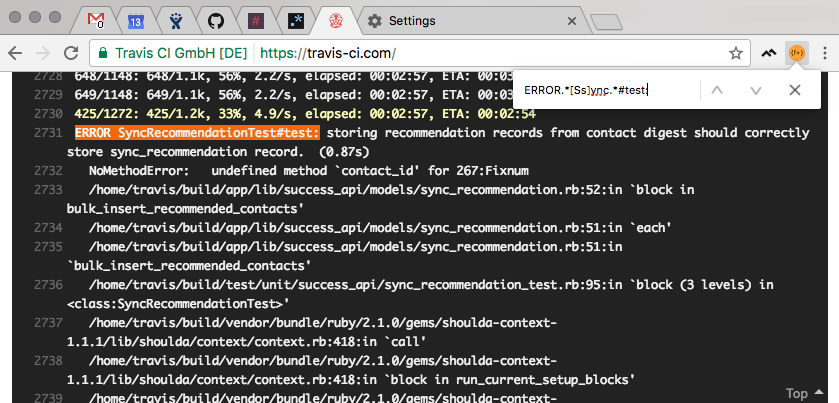
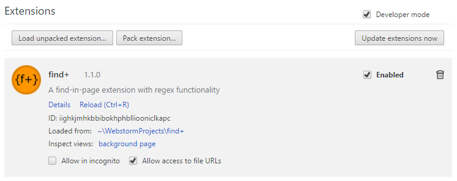

# **{find+}**
**{find+}** is a simple _Find-in-Page_ extension for Google Chrome hosting a the ability to search a web page or document by regular expression. It has been designed to look and behave much like the `CTRL-F` function, but extended to provide a feature-rich and robust user experience with the aim of completely replacing the native _Find-in-Page_ tool.

Our principle is simple, to deliver a reliable, robust, repeatable, performant, and native-like tool for the software and web development industry. _Perfection is simply not good enough._



## Motivation
As a software developer, looking through lengthy stack traces, continuous integration build history, or large text files is something we do very regularly. The Chrome _Find-in-Page_ tool works well in most cases, but offers very little when looking for very specific (or very general) keywords.

The idea to build this tool spawned as a response to poorly designed or dysfunctional regex-search extensions currently available, and the limited usefulness of the native tool. This extension has become a growing project aimed at giving developers better tools to simplify certain tasks and to improve upon the functionally-limited tools currently available.

## Getting Started
The **{find+}** Chrome extension has recently transitioned to public beta and has become available in the [Chrome Web Store](https://chrome.google.com/webstore/category/extensions). You can install the extension [here](https://chrome.google.com/webstore/detail/find%2B/fddffkdncgkkdjobemgbpojjeffmmofb).

Ready for extension development? You can also install the extension by using Developer Mode under the Chrome extension settings. These steps will help you get started.

Before you begin, ensure that you install the extension from the `master` branch. All other branches are under active development, which may not be stable.

First, you will need to clone the repository to your local machine. You can do this by clicking the green `Clone or Download` button in GitHub. If you are comfortable using git, you can copy the HTTPS clone link to your clipboard and clone the repository to a location on your local machine by running the following command in the terminal:

```
cd <directory you want to clone to>
git clone <clone link from clipboard>
```
<sup>Note: If you are using a Windows machine, you may need to install git [here](https://git-for-windows.github.io/).</sup>

Otherwise, you can click `Download ZIP` and extract the source files to a location on your computer. Ensure you are viewing the `master` branch.

To install the extension in Chrome, navigate to the Settings page in Chrome and click `Extensions` on the left. Enabling Developer Mode will show a button to `Load Unpacked Extension`, which you can use to navigate to the parent folder of the extension. Yay! You installed the extension!



## Keyboard Shortcuts
To open the extension popup using a keyboard shortcut, you must first assign a keyboard shortcut to the extension through the Chrome settings. You can do this by following these steps:
1. Navigate to the `Extensions` settings page in Chrome. Do this easily by typing `chrome://extensions/` in the URL navigation bar.
2. In the bottom right of the extensions list, click `Keyboard shortcuts`. This will make appear a dialog where you can modify the shortcuts for your installed extensions.
3. Locate the shortcut settings for find+. Click the input field located to the right of the label `Activate the extension`.
4. Press the combination of keys you would like to use to open the extension. Once complete, press `OK`.

Here's what we recommend for displaying the extension popup.

| Windows Shortcut  | macOS Shortcut    | Notes                                                                  |
| :---------------- | :---------------- | :--------------------------------------------------------------------- |
| CTRL-SHIFT-F      | COMMAND-SHIFT-F   | Recommended: This shortcut will not have any conflicts with Chrome     |
| CTRL-F            | COMMAND-F         | This shortcut will override the native find-in-page tool               |

Several keyboard shortcuts exist directly in the extension for performing different actions. These shortcuts are built directly into the extension and are not managed through Chrome. As a result, these settings cannot be remapped. Below is a list of the current keyboard shortcuts.

| Windows Shortcut  | macOS Shortcut    | Action                                                                 |
| :---------------- | :---------------- | :--------------------------------------------------------------------- |
| ENTER             | ENTER             | Advance to the next occurrence of the regular expression in the page   |
| SHIFT-ENTER       | SHIFT-ENTER       | Return to the previous occurrence of the regular expression in the page|
| CTRL-ALT-O        | CTRL-OPTION-O     | Expand or Collapse Options Pane                                        |
| CTRL-ALT-R        | CTRL-OPTION-R     | Expand or Collapse Replace Text Pane                                   |
| CTRL-ENTER or ESC | CTRL-ENTER or ESC | Close the extension popup                                              |

## Firefox Support
This extension is now compatible with Mozilla Firefox. You can install the extension [here](https://addons.mozilla.org/en-US/firefox/addon/brandon1024-find/).

<sup>Note: Although the extension is supported in Firefox, the extension was designed to be used in Chrome. As such, the user interface in Firefox is not as polished and refined. For the best user experience, use this extension in Chrome.</sup>

## Wiki
We are continuously updating [our wiki](https://github.com/brandon1024/find/wiki) to provide help for new users and developers. Having an issue using the extension? Check out our [Frequently Asked Questions](https://github.com/brandon1024/find/wiki/FAQ-:-General) wiki!

## A Small Notice
Since **{find+}** is still in beta, you may experience bugs or issues while using the extension. We are hard at work fixing these issues, but we encourage you to continue using our extension in the meantime. You can keep an eye on current issues in progress by monitoring our GitHub page.

See an issue we may have missed, or an idea for a new feature? Log an issue! We love to hear your feedback, it helps us make this project better.

## Contributing
Interested in contributing to **{find+}**? See [CONTRIBUTING](CONTRIBUTING.md).

## Authors
|[](https://github.com/brandon1024)|[](https://github.com/MikeWalz11) | [](https://github.com/brandon1024/find)
|:---:|:---:|:---:|
|[Brandon Richardson](https://github.com/brandon1024)| [Michael Walz](https://github.com/MikeWalz11) |[Become a Contributor](CONTRIBUTING.md)
|<sup>Co-Owner, Arch, Deployment</sup>|<sup>Co-Owner, UI, backend</sup>|<sup>Have a talent?</sup>
